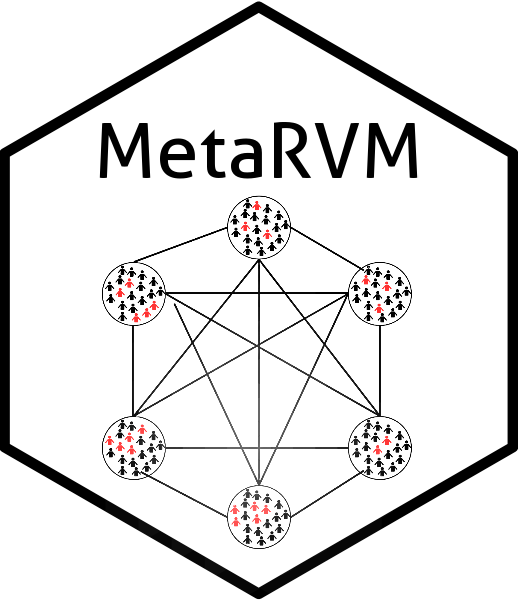
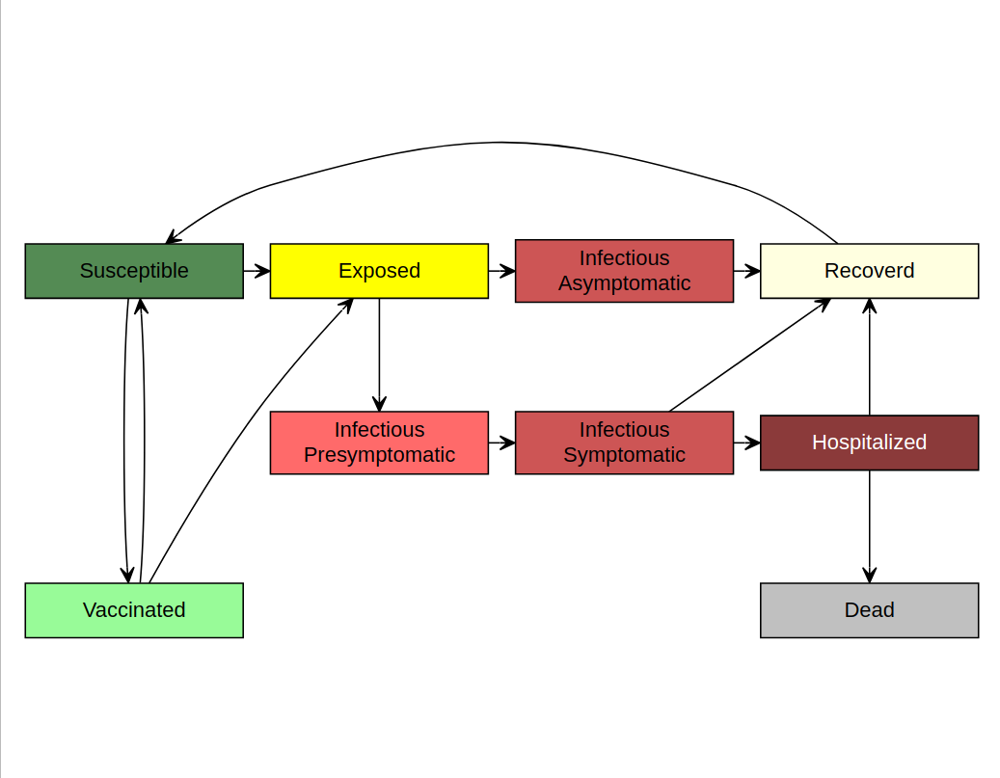

<!-- README.md is generated from README.Rmd. Please edit that file -->

# MetaRVM  


```{r, include = FALSE}
knitr::opts_chunk$set(
  collapse = TRUE,
  comment = "#>",
  fig.path = "man/figures/README-",
  out.width = "100%"
)
```

<!-- badges: start -->
[](https://github.com/RESUME-Epi/MetaRVM/actions/workflows/R-CMD-check.yaml)
[](https://app.codecov.io/gh/RESUME-Epi/MetaRVM)
[](https://lifecycle.r-lib.org/articles/stages.html)
[](https://RESUME-Epi.github.io/MetaRVM/)
[](https://CRAN.R-project.org/package=MetaRVM)
[](https://cran.r-project.org/package=MetaRVM)
<!-- badges: end -->

Stochastic metapopulation compartmental modeling of respiratory infectious diseases.

## Model

`MetaRVM` is an open-source R package for stochastic metapopulation modeling of respiratory infectious diseases. It supports multiple disease types and is designed for flexible stratification by geography, demographics, or any user-defined grouping. `MetaRVM` is built for real-time public health decision-making.

`MetaRVM` extends the classic SEIR framework with disease-specific compartments, time-varying contact patterns, and vaccination dynamics. Disease types currently supported: **flu** (influenza-like illness) and **measles**. Each disease has its own set of compartments, parameters, and initialization structure, all declared through a disease registry that keeps the core simulation engine disease-agnostic.



For more details, please refer to the paper: [Developing and deploying a use-inspired metapopulation modeling framework for detailed tracking of stratified health outcomes](https://www.medrxiv.org/content/10.1101/2025.05.05.25327021v1.full-text)


## Documentation

Full documentation is available at: https://RESUME-Epi.github.io/MetaRVM/


## Quickstart guide

### Installation

The current CRAN release is **2.1.0**. Install it with:

``` r
install.packages("MetaRVM")
```

The development version (2.2.0, adds measles model and programmatic config builder) is available from GitHub:

``` r
# install.packages("remotes")
remotes::install_github("RESUME-Epi/MetaRVM")
```

### Running a simulation

Configs can be supplied as a YAML file path or built programmatically with `build_config()`.

```{r}
library(MetaRVM)
options(odin.verbose = FALSE)

## prepare the configuration file
cfg <- system.file("extdata", "example_config.yaml", package = "MetaRVM")
```

The content of the yaml configuration file:
```yaml
model:
  disease: flu
run_id: ExampleRun
population_data:
  initialization: population_init_n24.csv
  vaccination: vaccination_n24.csv
mixing_matrix:
  weekday_day: m_weekday_day.csv
  weekday_night: m_weekday_night.csv
  weekend_day: m_weekend_day.csv
  weekend_night: m_weekend_night.csv
disease_params:
  ts: 0.5
  ve: 0.4
  dv: 180
  dp: 1
  de: 3
  da: 5
  ds: 6
  dh: 8
  dr: 180
  pea: 0.3
  psr: 0.95
  phr: 0.97
simulation_config:
  start_date: 10/01/2023 # m/d/Y
  length: 150
  nsim: 1
  nrep: 1
  random_seed: 42
```

```{r}
# run simulation
sim_out <- metaRVM(cfg)

# basic plot: daily hospitalizations by date
library(ggplot2)
hosp <- sim_out$results[disease_state == "H"]
hosp_sum <- hosp[disease_state == "H", .(total = sum(value)), by = "date"]
ggplot(hosp_sum, aes(date, total)) +
  geom_line(, color = "red") +
  labs(y = "Hospitalizations", x = "Date") + theme_bw()
```


## Model structure

`MetaRVM` implements stratified metapopulation models where each demographic subgroup has its own set of compartments and disease progression. All simulations are stochastic.

Transmission is stratified by user-defined demographic groups (e.g., age, zone, race). Time-varying mixing matrices define how these strata interact (daytime vs. nighttime, weekday vs. weekend), and `MetaRVM` computes stratum-specific forces of infection. Parameters can be specified as fixed scalars or drawn from distributions (lognormal, gamma, uniform, beta, gaussian), enabling uncertainty quantification across simulation runs.

For simulation control:
- `nsim` sets the number of parameter sets; when distributions are used, each draw is a row in sampled parameter matrices
- `nrep` sets the number of stochastic replicates per parameter set
- total runs = `nsim × nrep`
- `random_seed` ensures reproducibility for both parameter sampling and stochastic trajectories

---

### Required input data and configuration

`MetaRVM` is configured through a YAML file or the `build_config()` programmatic builder — both accept the same arguments. A small set of CSV inputs are required alongside the config.

| Input | Required? | Description |
|-------|-----------|-------------|
| Population initialization (`population_init.csv`) | Yes | Defines demographic strata with user-defined category columns (e.g., age, zone, race, income_level) and initial population states. Categories are automatically detected from column names. |
| Mixing matrices (`mixing_matrix_*.csv`) | Yes | Four contact matrices, consistent with the population strata. These typically represent weekday/weekend and day/night mixing patterns. |
| Vaccination schedule (`vaccination.csv`) | Flu only | Time-varying vaccination counts or rates by stratum, used to move individuals from `S` to `V`. Not required for measles. |
| Disease parameters | Yes | Scalar values or distribution specs (lognormal, gamma, etc.) for each disease-specific parameter. See the pkgdown reference for per-disease parameter lists. |
| Checkpoint files | Optional (flu) | Internal model state snapshots used to resume or branch simulations (e.g., for phased calibration). |

### Model output structure

`MetaRVM` produces simulation results in a unified **tidy long-format table** that is easy to analyze with `data.table`, `dplyr`, or `ggplot2`. Every record corresponds to a single compartment count or flow quantity for a specific demographic stratum, simulation date, and scenario/instance.

The core output is available in:

- `sim$results` — compartment counts and flows for each day  
- `sim$config` — the configuration object used to generate the run  

---


## Further examples and full documentation

MetaRVM includes several vignettes that demonstrate common workflows using real model configurations and data. These provide detailed, step-by-step examples of how to prepare inputs, configure the model, run simulations, and analyze outputs.

The vignettes can be accessed at:

**https://resume-epi.github.io/MetaRVM/articles/**

List of vignettes:

- **Getting Started**  
  A gentle introduction showing how to load a configuration file, run a simulation, and inspect outputs.

- **Model Configurations**  
  A detailed walkthrough of the YAML structure, required fields, parameter blocks, optional modules, and how to define population strata and mixing patterns.

- **Running Simulation**
  Full example using a complete set of input files, showing how MetaRVM reads population initialization data, mixing matrices, and vaccination schedules.

<!-- - **Understanding Outputs**  
  Explains the structure of `sim$results`, the meaning of disease states and flow variables, and how to compute aggregated quantities. -->

- **Checkpointing and Restoring**  
  Demonstrates how to run many scenarios at scale, resume long runs, and store intermediate model states.

<!-- - **End-to-End Example** *(recommended)*  
  Uses a realistic toy city with multiple age groups and zones to show the entire workflow—from inputs and configuration to final epidemiological summaries and visualizations. -->

For the complete function reference, visit:

**https://resume-epi.github.io/MetaRVM/reference/**
