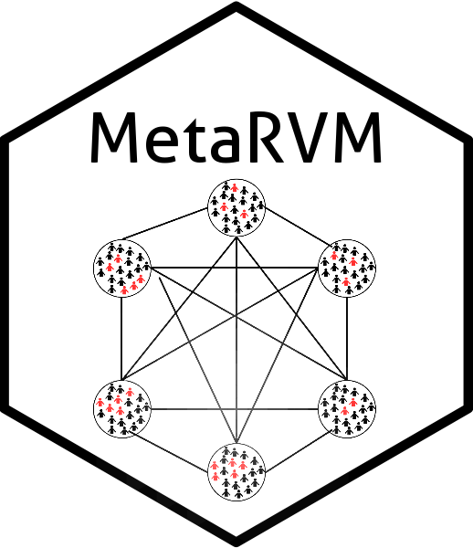
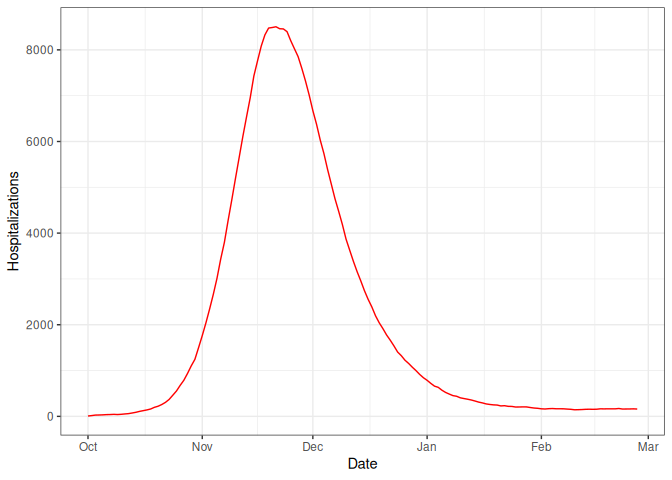

<!-- README.md is generated from README.Rmd. Please edit that file -->

# MetaRVM 

<!-- badges: start -->

[](https://github.com/NSF-RESUME/MetaRVM/actions/workflows/R-CMD-check.yaml)
<!-- badges: end -->

This is a compartmental model simulation code for generic respiratory
virus diseases.

## Model

`MetaRVM` is an open-source R package for modeling the spread of
infectious diseases in subpopulations, which can be flexibly defined by
geography, demographics, or other stratifications. It is designed to
support real-time public health decision-making. `MetaRVM` is a
metapopulation model, which extends the classic
Susceptible-Infected-Recovered (SIR) framework by propagating infection
across interacting subpopulations (e.g., age groups, neighborhoods),
whose interactions are governed by realistic mixing patterns.

The `MetaRVM` model builds upon the SEIR framework by introducing
additional compartments to capture more detailed dynamics of disease
progression, while allowing for heterogeneous mixing among different
demographic stratum. These generalizations allow the model to account
for factors such as vaccinations, hospitalizations, and fatalities.

<figure>

<figcaption aria-hidden="true">Model schematics</figcaption>
</figure>

For more details, please refer to the paper: [Developing and deploying a
use-inspired metapopulation modeling framework for detailed tracking of
stratified health
outcomes](https://www.medrxiv.org/content/10.1101/2025.05.05.25327021v1.full-text)

## Documentation

Full documentation is available at:
<https://RESUME-Epi.github.io/MetaRVM/>

## Quickstart guide

### Installation

``` r
install.packages("MetaRVM")
```

The development version of `MetaRVM` can be installed from
[GitHub](https://github.com/) with:

``` r
# install.packages("devtools")
devtools::install_github("NSF-RESUME/MetaRVM")
```

### Running a simulation

``` r
library(MetaRVM)
options(odin.verbose = FALSE)

## prepare the configuration file
cfg <- system.file("extdata", "example_config.yaml", package = "MetaRVM")
```

The content of the yaml configuration file:

``` yaml
run_id: ExampleRun
population_data:
  mapping: demographic_mapping_n24.csv
  initialization: population_init_n24.csv
  vaccination: vaccination_n24.csv
mixing_matrix:
  weekday_day: m_weekday_day.csv
  weekday_night: m_weekday_night.csv
  weekend_day: m_weekend_day.csv
  weekend_night: m_weekend_night.csv
disease_params:
  ts: 0.5
  tv: 0.25
  ve: 0.4
  dv: 180
  dp: 1
  de: 3
  da: 5
  ds: 6
  dh: 8
  dr: 180
  pea: 0.3
  psr: 0.95
  phr: 0.97
simulation_config:
  start_date: 10/01/2023 # m/d/Y
  length: 150
  nsim: 1
```

``` r
# run simulation
sim_out <- metaRVM(cfg)
#> Loading required namespace: pkgbuild

# basic plot: daily hospitalizations by date
library(ggplot2)
hosp <- sim_out$results[disease_state == "H"]
hosp_sum <- hosp[disease_state == "H", .(total = sum(value)), by = "date"]
ggplot(hosp_sum, aes(date, total)) +
  geom_line(, color = "red") +
  labs(y = "Hospitalizations", x = "Date") + theme_bw()
```



## Model structure

`MetaRVM` implements a stratified SEIR-type metapopulation model with
vaccination, hospitalization, immunity waning, and reinfection. The core
health states in each demographic stratum are:

- **Susceptible** `S`
- **Vaccinated** `V`
- **Exposed** `E`
- **Asymptomatic infectious** `I_asymp`
- **Presymptomatic infectious** `I_presymp`
- **Symptomatic infectious** `I_symp`
- **Hospitalized** `H`
- **Recovered** `R`
- **Deceased** `D`

At the start of a simulation, nearly all individuals are in `S`, with
optional seeding of initial infections and/or vaccinated individuals in
`V`. When susceptible or vaccinated individuals come into contact with
infectious individuals, they become exposed (`E`) based on
age/stratum-specific forces of infection and vaccine protection. Exposed
individuals then progress through asymptomatic, presymptomatic, and
symptomatic infectious states before either recovering, being
hospitalized, or dying. Vaccinated and recovered immunity can wane over
time, returning individuals to the susceptible pool, which allows
`MetaRVM` to represent multiple respiratory pathogens with different
natural histories.

Transmission is stratified by user-defined demographic groups (e.g.,
age, zone, race). Time-varying mixing matrices define how these strata
interact (daytime vs. nighttime, weekday vs. weekend), and `MetaRVM`
computes stratum-specific forces of infection for susceptible and
vaccinated individuals. Hospitalized and deceased individuals are
excluded from the “effective” mixing population. The same model can be
run in deterministic or stochastic mode, and parameters are supplied
through a YAML configuration.

------------------------------------------------------------------------

### Core disease progression parameters

| Parameter | Description | Units / notes |
|----|----|----|
| `ve` | Vaccine efficacy parameter controlling how strongly vaccination reduces infection risk. | Dimensionless (0–1). |
| `dv` | Average duration of vaccine-conferred immunity; vaccination wanes at rate `1/dv`. | Days. |
| `de` | Average incubation period; duration in `E` before becoming infectious. | Days. |
| `pea` | Proportion of exposed individuals who become asymptomatic infectious (`Ia`). | Probability (0–1). |
| `da` | Average duration in asymptomatic infectious state `Ia`. | Days. |
| `dp` | Average duration in presymptomatic infectious state `Ip`. | Days. |
| `ds` | Average duration in symptomatic infectious state `Is` before recovery or hospitalization. | Days. |
| `psr` | Fraction of symptomatic (`Is`) individuals who recover directly without hospitalization. | Probability (0–1). |
| `dh` | Average length of stay in the hospitalized state `H`. | Days. |
| `phd` | Proportion of hospitalized individuals who die (transition `H → D`); remaining recover. | Probability (0–1). |
| `dr` | Average duration of post-infection immunity in `R` before waning; reinfection occurs at rate `1/dr`. | Days. |

------------------------------------------------------------------------

### Transmission and mixing parameters

| Parameter | Description | Units / notes |
|----|----|----|
| `ts` | Transmission scaling factor for susceptible individuals; controls strength of `S`–`I` transmission. | Per-contact scaling factor. |
| `tv` | Transmission scaling factor for vaccinated individuals. | Same scale as `ts`. |
| `M` | Mixing matrix of order `J × J`, where `m_ij` is the fraction of contacts that a member of stratum `i` has with stratum `j`. | Dimensionless; rows sum to 1. |

These parameters drive the transitions from `S` and `V` to `E`, and
determine how quickly individuals move through infectious, hospitalized,
recovered, and deceased states.

------------------------------------------------------------------------

### Required input data and configuration

`MetaRVM` is configured through a YAML file and a small set of CSV
inputs.

| Input | Required? | Description |
|----|----|----|
| Population mapping (`population.csv`) | Yes | Defines each demographic stratum (e.g., age, zone, race) and its population size. Column names must match those referenced in the YAML configuration. |
| Mixing matrices (`mixing_matrix_*.csv`) | Yes | Four contact matrices, consistent with the strata defined in `population.csv`. These typically represent weekday/weekend and day/night mixing patterns. |
| Vaccination schedule (`vaccination.csv`) | Yes | Time-varying vaccination counts or rates by stratum, used to move individuals from `S` to `V`. |
| Model parameters | Yes | High-level model specification: simulation dates, `dt`, parameter values (e.g., `ve`, `de`, `dv`, `pea`, `psr`, `βs`, `βv`), output controls, and checkpointing options. |
| Checkpoint files | Optional | Internal model state snapshots used to resume or branch simulations (e.g., for phased calibration). |

### Model output structure

`MetaRVM` produces simulation results in a unified **tidy long-format
table** that is easy to analyze with `data.table`, `dplyr`, or
`ggplot2`. Every record corresponds to a single compartment count or
flow quantity for a specific demographic stratum, simulation date, and
scenario/instance.

The core output is available in:

- `sim$results` — compartment counts and flows for each day  
- `sim$config` — the configuration object used to generate the run

------------------------------------------------------------------------

## Further examples and full documentation

MetaRVM includes several vignettes that demonstrate common workflows
using real model configurations and data. These provide detailed,
step-by-step examples of how to prepare inputs, configure the model, run
simulations, and analyze outputs.

The vignettes can be accessed at:

**<https://resume-epi.github.io/MetaRVM/articles/>**

List of vignettes:

- **Getting Started**  
  A gentle introduction showing how to load a configuration file, run a
  simulation, and inspect outputs.

- **Model Configurations**  
  A detailed walkthrough of the YAML structure, required fields,
  parameter blocks, optional modules, and how to define population
  strata and mixing patterns.

- **Running Simulation**  
  Full example using a complete set of input files, showing how MetaRVM
  reads population mappings, mixing matrices, and vaccination schedules.

<!-- - **Understanding Outputs**  
  Explains the structure of `sim$results`, the meaning of disease states and flow variables, and how to compute aggregated quantities. -->

- **Checkpointing and Restoring**  
  Demonstrates how to run many scenarios at scale, resume long runs, and
  store intermediate model states.

<!-- - **End-to-End Example** *(recommended)*  
  Uses a realistic toy city with multiple age groups and zones to show the entire workflow—from inputs and configuration to final epidemiological summaries and visualizations. -->

For the complete function reference, visit:

**<https://resume-epi.github.io/MetaRVM/reference/>**
