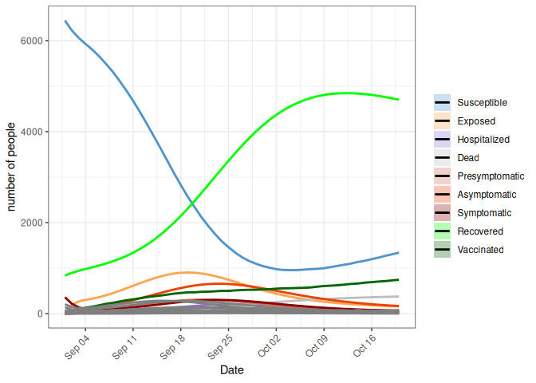

<!-- README.md is generated from README.Rmd. Please edit that file -->

# MetaRVM 

<!-- badges: start -->

[](https://github.com/NSF-RESUME/MetaRVM/actions/workflows/R-CMD-check.yaml)
<!-- badges: end -->

This is a compartmental model simulation code for generic respiratory
virus diseases.

## Model

<figure>

<figcaption aria-hidden="true">Model schematics</figcaption>
</figure>

## Installation

You can install the development version of MetaRVM from
[GitHub](https://github.com/) with:

``` r
# install.packages("devtools")
devtools::install_github("NSF-RESUME/MetaRVM")
```

## Example

This is a basic example which shows how to run the simulation from R
command line.

``` r
library(MetaRVM)
library(ggplot2)
```

We will create some data sets that will be used for this demonstration.
This is a meta-population model, i.e., the total population is divided
in several sub-populations (based on some common attributes such as
zones, age-groups, races etc.). The mixing pattern within and between
these sub-populations are dictated by a mixing matrix, which will be
explained later. In summary, to run the meta-population simulation, we
need 1. population sizes and model initialization information, 2.
vaccination information, 3. mixing matrices.

#### Population

For this example, we define our sub-populations by the 6 HCZ (Healthy
Chicago Zone) in Chicago, IL. For each sub-population we need to provide
the model the total population size (N), number of susceptible (S),
infectious (I) and vaccinated (v) people at the start of the simulation.

``` r
## Model initialization
N_pop <- 6
pop_zones <- data.frame(N = rep(NA, N_pop),
                        S0 = rep(NA, N_pop),
                        I0 = rep(NA, N_pop),
                        V0 = rep(NA, N_pop))

pop_zones$N <- sample(1000:1500, N_pop)
pop_zones$I0 <- sample(10:100, N_pop)
pop_zones$V0 <- sample(1:10, N_pop)
pop_zones$R0 <- sample(100:200, N_pop)
pop_zones$S0 <- pop_zones$N - pop_zones$I0 - pop_zones$V0 - pop_zones$R0

pop_zones
#>      N   S0 I0 V0  R0
#> 1 1294 1082 58  2 152
#> 2 1416 1160 92 10 154
#> 3 1039  900 25  1 113
#> 4 1235 1063 55  7 110
#> 5 1289 1076 43  3 167
#> 6 1398 1163 86  8 141
```

#### Vaccination

The vaccination data has the time indices when the vaccination occured
in the first column with the column name `t` and the other columns
contain the number vaccinations in each sub-populations ordered from
left to right.

``` r
## Vaccine profile
sim_length <- 100
tt <- seq(0, sim_length, by = 1)
nt <- length(tt)
vol <- sample(1:10, (nt-1)*N_pop, replace = TRUE)

vac_zones <- cbind(tt, rbind(pop_zones$V0, matrix(vol, nrow = nt-1)))
colnames(vac_zones) <- c("t", paste0("v", 1:N_pop))

head(vac_zones)
#>      t v1 v2 v3 v4 v5 v6
#> [1,] 0  2 10  1  7  3  8
#> [2,] 1  7  5  4  5  1  6
#> [3,] 2  2  9  1 10  7  1
#> [4,] 3  8  8  6  9 10  3
#> [5,] 4  5  4  3  9  4  9
#> [6,] 5  8  4  9  8  6  2
```

``` r
## mixing matrix

m1 <- m2 <- m3 <- m4 <- matrix(NA, nrow = N_pop, ncol = N_pop)
diag(m1) <- round(runif(N_pop, min = 0.85, max = 0.92), 2)
diag(m2) <- 1
diag(m3) <- round(runif(N_pop, min = 0.7, max = 0.9), 2)
diag(m4) <- 1

for(ii in 1:N_pop){
  tmp <- runif(N_pop - 1)
  m1[ii, -ii] <- round(tmp * (1 - m1[ii, ii]) / sum(tmp), 2)
  m2[ii, -ii] <- 0
  m3[ii, -ii] <- round(tmp * (1 - m3[ii, ii]) / sum(tmp), 2)
  m4[ii, -ii] <- 0
}

m_weekday_day <- m1
m_weekday_night <- m2
m_weekend_day <- m3
m_weekend_night <- m4
```

Then run the simulation:

``` r
out <- meta_sim(N_pop = N_pop,
                ts = 0.7,
                tv = 0.2,
                S0 = pop_zones$S0,
                I0 = pop_zones$I0,
                P0 = pop_zones$N,
                R0 = pop_zones$R0,
                m_weekday_day = m_weekday_day,
                m_weekend_day = m_weekend_day,
                m_weekday_night = m_weekday_night,
                m_weekend_night = m_weekend_night,
                delta_t = 0.5,
                vac_mat = as.matrix(vac_zones),
                dv = 50,
                de = 3,
                pea = 0.5,
                dp = 2,
                da = 5,
                ds = 2,
                psr = 0.5,
                dh = 3,
                phr = 0.8,
                dr = 50,
                ve = 0.5,
                nsteps = 100,
                is.stoch = 0,
                seed = NULL)
#> Loading required namespace: pkgbuild
#> Generating model in c
#> ℹ Re-compiling odin1b45cb2c (debug build)
#> ── R CMD INSTALL ───────────────────────────────────────────────────────────────
#> * installing *source* package ‘odin1b45cb2c’ ...
#> ** using staged installation
#> ** libs
#> using C compiler: ‘gcc (Ubuntu 13.3.0-6ubuntu2~24.04) 13.3.0’
#> gcc -I"/usr/share/R/include" -DNDEBUG       -fpic  -g -O2 -fno-omit-frame-pointer -mno-omit-leaf-frame-pointer -ffile-prefix-map=/build/r-base-FPSnzf/r-base-4.3.3=. -fstack-protector-strong -fstack-clash-protection -Wformat -Werror=format-security -fcf-protection -fdebug-prefix-map=/build/r-base-FPSnzf/r-base-4.3.3=/usr/src/r-base-4.3.3-2build2 -Wdate-time -D_FORTIFY_SOURCE=3  -UNDEBUG -Wall -pedantic -g -O0 -c odin.c -o odin.o
#> gcc -I"/usr/share/R/include" -DNDEBUG       -fpic  -g -O2 -fno-omit-frame-pointer -mno-omit-leaf-frame-pointer -ffile-prefix-map=/build/r-base-FPSnzf/r-base-4.3.3=. -fstack-protector-strong -fstack-clash-protection -Wformat -Werror=format-security -fcf-protection -fdebug-prefix-map=/build/r-base-FPSnzf/r-base-4.3.3=/usr/src/r-base-4.3.3-2build2 -Wdate-time -D_FORTIFY_SOURCE=3  -UNDEBUG -Wall -pedantic -g -O0 -c registration.c -o registration.o
#> gcc -shared -L/usr/lib/R/lib -Wl,-Bsymbolic-functions -flto=auto -ffat-lto-objects -Wl,-z,relro -o odin1b45cb2c.so odin.o registration.o -L/usr/lib/R/lib -lR
#> installing to /tmp/Rtmp8YQ8wA/devtools_install_71b6316030028/00LOCK-file71b634ab24be3/00new/odin1b45cb2c/libs
#> ** checking absolute paths in shared objects and dynamic libraries
#> * DONE (odin1b45cb2c)
#> ℹ Loading odin1b45cb2c

head(out, n = 20)
#>      step  time disease_state population_id value
#>     <num> <num>        <char>        <char> <num>
#>  1:     0     0             S             1  1082
#>  2:     0     0             S             2  1160
#>  3:     0     0             S             3   900
#>  4:     0     0             S             4  1063
#>  5:     0     0             S             5  1076
#>  6:     0     0             S             6  1163
#>  7:     0     0             E             1     0
#>  8:     0     0             E             2     0
#>  9:     0     0             E             3     0
#> 10:     0     0             E             4     0
#> 11:     0     0             E             5     0
#> 12:     0     0             E             6     0
#> 13:     0     0     I_presymp             1     0
#> 14:     0     0     I_presymp             2     0
#> 15:     0     0     I_presymp             3     0
#> 16:     0     0     I_presymp             4     0
#> 17:     0     0     I_presymp             5     0
#> 18:     0     0     I_presymp             6     0
#> 19:     0     0       I_asymp             1     0
#> 20:     0     0       I_asymp             2     0
#>      step  time disease_state population_id value
```

## Vizualizations

These are some easy ways to create visualizations on the output of the
simulation. These functionalities will be added later as functions to
the package.

#### Aggregate level plot

``` r
# covert to daily counts and long format
# The daily_output() function requires an instance column in the out data.table
# instance column is used to create summaries if there are multiple simulations
# occuring.

out$instance <- 1

long_out_daily <- daily_output(out, start_date = as.Date("2023-09-01"))
plot_metaRVM(long_out_daily,
                   conf_level = 90,
                   value_column = "total_value", is.plotly = FALSE)
```



To run this simulation interactively, use the provided shiny app

``` r
MetaRVM::run_app()
```
