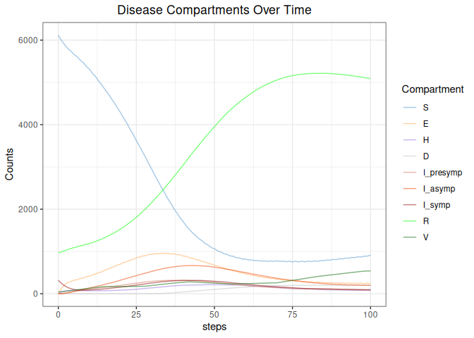

<!-- README.md is generated from README.Rmd. Please edit that file -->

# MetaRVM 

<!-- badges: start -->

[](https://github.com/NSF-RESUME/MetaRVM/actions/workflows/R-CMD-check.yaml)
<!-- badges: end -->

This is a compartmental model simulation code for generic respiratory
virus diseases.

## Model

<figure>

<figcaption aria-hidden="true">Model schematics</figcaption>
</figure>

## Installation

You can install the development version of MetaRVM from
[GitHub](https://github.com/) with:

``` r
# install.packages("devtools")
devtools::install_github("NSF-RESUME/MetaRVM")
```

## Example

This is a basic example which shows how to run the simulation from R
command line.

``` r
library(MetaRVM)
```

We will create some data sets that will be used for this demonstration.
This is a meta-population model, i.e., the total population is divided
in several sub-populations (based on some common attributes such as
zones, age-groups, races etc.). The mixing pattern within and between
these sub-populations are dictated by a mixing matrix, which will be
explained later. In summary, to run the meta-population simulation, we
need 1. population sizes and model initialization information, 2.
vaccination information, 3. mixing matrices.

#### Population

For this example, we define our sub-populations by the 6 HCZ (Healthy
Chicago Zone) in Chicago, IL. For each sub-population we need to provide
the model the total population size (N), number of susceptible (S),
infectious (I) and vaccinated (v) people at the start of the simulation.

``` r
## Model initialization
N_pop <- 6
pop_zones <- data.frame(N = rep(NA, N_pop),
                        S0 = rep(NA, N_pop),
                        I0 = rep(NA, N_pop),
                        V0 = rep(NA, N_pop))

pop_zones$N <- sample(1000:1500, N_pop)
pop_zones$I0 <- sample(10:100, N_pop)
pop_zones$V0 <- sample(1:10, N_pop)
pop_zones$R0 <- sample(100:200, N_pop)
pop_zones$S0 <- pop_zones$N - pop_zones$I0 - pop_zones$V0 - pop_zones$R0

pop_zones
#>      N   S0 I0 V0  R0
#> 1 1058  854 12  2 190
#> 2 1124  909 51  7 157
#> 3 1245 1003 86  8 148
#> 4 1276 1142 10  5 119
#> 5 1190  940 81  9 160
#> 6 1185  976 35  6 168
```

#### Vaccination

The vaccination data has the time indices when the vaccination occured
in the first column with the column name `t` and the other columns
contain the number vaccinations in each sub-populations ordered from
left to right.

``` r
## Vaccine profile
tt <- seq(0, 100, by = 14)
nt <- length(tt)
vol <- sample(1:10, (nt-1)*N_pop, replace = TRUE)

vac_zones <- cbind(tt, rbind(pop_zones$V0, matrix(vol, nrow = nt-1)))
colnames(vac_zones) <- c("t", paste0("v", 1:N_pop))

vac_zones
#>       t v1 v2 v3 v4 v5 v6
#> [1,]  0  2  7  8  5  9  6
#> [2,] 14  3  4  5  1  3  5
#> [3,] 28  5  5 10  1  5  7
#> [4,] 42  6  6 10  1  1  1
#> [5,] 56  1  4  2  6  8  1
#> [6,] 70  3  1 10  3  1  8
#> [7,] 84  8  6  9  9  6  7
#> [8,] 98  5  2  3  4  7  8
```

``` r
## mixing matrix

m1 <- m2 <- m3 <- m4 <- matrix(NA, nrow = N_pop, ncol = N_pop)
diag(m1) <- round(runif(N_pop, min = 0.85, max = 0.92), 2)
diag(m2) <- 1
diag(m3) <- round(runif(N_pop, min = 0.7, max = 0.9), 2)
diag(m4) <- 1

for(ii in 1:N_pop){
  tmp <- runif(N_pop - 1)
  m1[ii, -ii] <- round(tmp * (1 - m1[ii, ii]) / sum(tmp), 2)
  m2[ii, -ii] <- 0
  m3[ii, -ii] <- round(tmp * (1 - m3[ii, ii]) / sum(tmp), 2)
  m4[ii, -ii] <- 0
}

m_weekday_day <- m1
m_weekday_night <- m2
m_weekend_day <- m3
m_weekend_night <- m4
```

Then run the simulation:

``` r
out <- meta_sim(N_pop = N_pop,
                ts = 0.7,
                tv = 0.2,
                S0 = pop_zones$S0,
                I0 = pop_zones$I0,
                P0 = pop_zones$N,
                V0 = pop_zones$V0,
                R0 = pop_zones$R0,
                m_weekday_day = m_weekday_day,
                m_weekend_day = m_weekend_day,
                m_weekday_night = m_weekday_night,
                m_weekend_night = m_weekend_night,
                delta_t = 0.5,
                tvac = vac_zones[, 1],
                vac_mat = as.matrix(vac_zones[, 2:7]),
                dv = 50,
                de = 3,
                pea = 0.5,
                dp = 2,
                da = 5,
                ds = 2,
                psr = 0.5,
                dh = 3,
                phr = 2,
                dr = 50,
                ve = 0.5,
                nsteps = 100,
                is.stoch = 0,
                seed = NULL)
#> Loading required namespace: pkgbuild
#> Generating model in c
#> ℹ Re-compiling odind60a1e19 (debug build)
#> ── R CMD INSTALL ───────────────────────────────────────────────────────────────
#> * installing *source* package ‘odind60a1e19’ ...
#> ** using staged installation
#> ** libs
#> using C compiler: ‘gcc (Ubuntu 13.3.0-6ubuntu2~24.04) 13.3.0’
#> gcc -I"/usr/share/R/include" -DNDEBUG       -fpic  -g -O2 -fno-omit-frame-pointer -mno-omit-leaf-frame-pointer -ffile-prefix-map=/build/r-base-FPSnzf/r-base-4.3.3=. -fstack-protector-strong -fstack-clash-protection -Wformat -Werror=format-security -fcf-protection -fdebug-prefix-map=/build/r-base-FPSnzf/r-base-4.3.3=/usr/src/r-base-4.3.3-2build2 -Wdate-time -D_FORTIFY_SOURCE=3  -UNDEBUG -Wall -pedantic -g -O0 -c odin.c -o odin.o
#> gcc -I"/usr/share/R/include" -DNDEBUG       -fpic  -g -O2 -fno-omit-frame-pointer -mno-omit-leaf-frame-pointer -ffile-prefix-map=/build/r-base-FPSnzf/r-base-4.3.3=. -fstack-protector-strong -fstack-clash-protection -Wformat -Werror=format-security -fcf-protection -fdebug-prefix-map=/build/r-base-FPSnzf/r-base-4.3.3=/usr/src/r-base-4.3.3-2build2 -Wdate-time -D_FORTIFY_SOURCE=3  -UNDEBUG -Wall -pedantic -g -O0 -c registration.c -o registration.o
#> gcc -shared -L/usr/lib/R/lib -Wl,-Bsymbolic-functions -flto=auto -ffat-lto-objects -Wl,-z,relro -o odind60a1e19.so odin.o registration.o -L/usr/lib/R/lib -lR
#> installing to /tmp/RtmpqUq31p/devtools_install_130d70760a60c2/00LOCK-file130d7026c74d33/00new/odind60a1e19/libs
#> ** checking absolute paths in shared objects and dynamic libraries
#> * DONE (odind60a1e19)
#> ℹ Loading odind60a1e19
```

There are some utility functions to extract a subset of disease states
from the output data frame. For example, if we want to extract all
infectious compartments, we can do this by the utility function
`get_disease_state`. We can further subset the output by HCE zone id.

``` r
out_I <- get_disease_state(data.frame(out), disease_states = c("I_presymp", "I_asymp", "I_symp"))
out_I_hce2 <- get_HCEZ(data.frame(out), disease_states = c("I_presymp", "I_asymp", "I_symp"), HCEZ_id = 2)
```

## Vizualizations

These are some easy way to create visualizations on the output of the
simulation. These functionalities will be added later as functions to
the package.

#### Aggregate level plot

``` r
library(ggplot2)
library(dplyr)
#> 
#> Attaching package: 'dplyr'
#> The following objects are masked from 'package:stats':
#> 
#>     filter, lag
#> The following objects are masked from 'package:base':
#> 
#>     intersect, setdiff, setequal, union

compartment_colors <- c("S" = "steelblue3",
                              "E" = "tan1",
                              "I_presymp" = "salmon3",
                              "I_asymp" = "orangered2",
                              "I_symp" = "red4",
                              "H" = "mediumpurple",
                              "R" = "green",
                              "D" = "grey",
                              "V" = "darkgreen")

long_out <- get_disease_state(data.frame(out))

ggplot(long_out %>% filter(disease_state %in% c("S", "E", "H", "D",
                                                "I_presymp", "I_asymp",
                                                "I_symp", "R", "V")) %>%
                          mutate(disease_state = factor(disease_state,
                                                        levels = c("S", "E", "H", "D",
                                                                   "I_presymp", "I_asymp",
                                                                   "I_symp", "R", "V"))) %>%
                          group_by(step, disease_state) %>%
                          summarize(total_value = sum(value), .groups = "drop"),
       aes(x = step, y = total_value, color = disease_state)) +
          geom_line(linewidth = 0.5, alpha = 0.5) +
          scale_color_manual(values = compartment_colors) +
          labs(
            title = "Disease Compartments Over Time",
            x = "steps",
            y = "Counts",
            color = "Compartment",
          ) +
          theme_bw() +
          theme(
            plot.title = element_text(hjust = 0.5),
            legend.position = "right"
          )
```



To run this simulation interactively, use the provided shiny app

``` r
MetaRVM::run_app()
```
