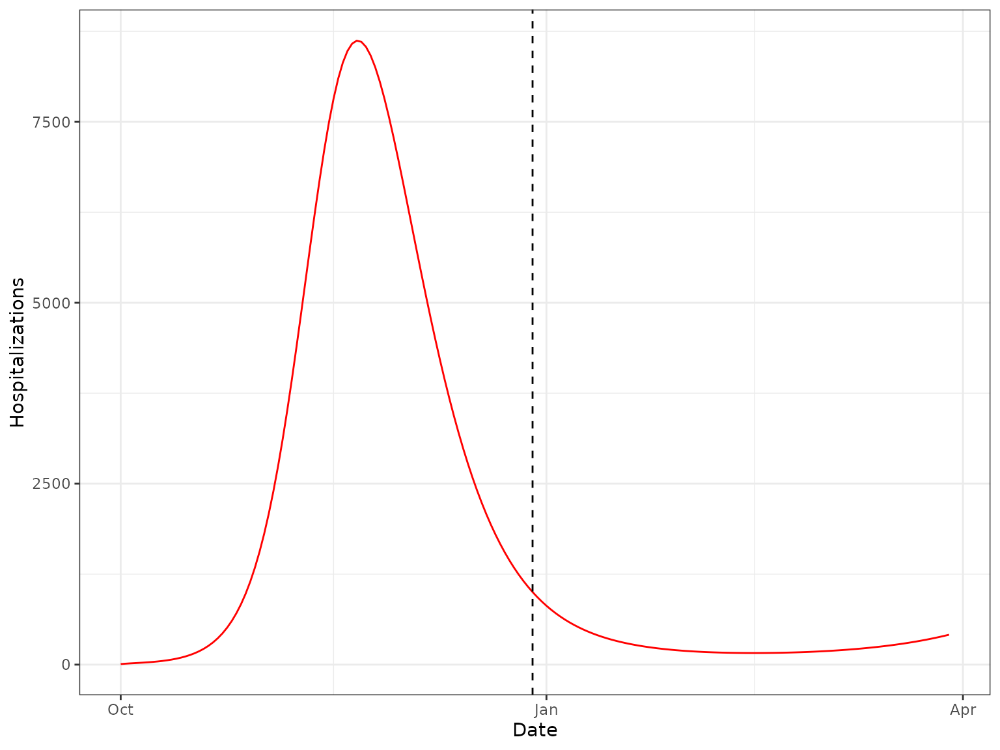

# Checkpointing in MetaRVM

## Introduction

This vignette demonstrates how to configure and use the checkpointing
functionality in MetaRVM with examples. Checkpointing allows to store
the model state at specific time points during the simulation, allowing
one to resume runs from saved states.

## How Checkpointing Works

MetaRVM’s checkpointing system is configured through the YAML
configuration file.

1.  **Saving checkpoints**: During simulation, the complete state
    (compartments, parameters, time step) is saved to disk at specified
    dates
2.  **Restoring from checkpoints**: A new simulation can be initialized
    from a previously saved checkpoint, continuing from that point
    forward
3.  **Flexible scheduling**: Exact dates when checkpoints should be
    saved are to be supplied, or by default it will checkpoint at the
    end-of-simulation date.

### Configuration Parameters

The checkpointing system uses three main configuration options in the
`simulation_config` section:

- **`checkpoint_dir`**: Directory where checkpoint files will be saved
  (created if it doesn’t exist)
- **`checkpoint_dates`**: (Optional) List of specific dates when
  checkpoints should be saved
- **`restore_from`**: (Optional) Path to a checkpoint file to resume
  from

## Example

For the purpose of this example, we will set the checkpointed directory
to be a temporary directory, and will create a temporary yaml
configuration file based on a template.

### Set Up

``` r
library(MetaRVM)
options(odin.verbose = FALSE)

# Get the example configuration file
example_config <- system.file("extdata", "example_config_checkpoint.yaml", 
                              package = "MetaRVM")

# Create a temporary directory for checkpoints
checkpoint_dir <- tempdir()
cat("Checkpoint directory:", checkpoint_dir, "\n")
#> Checkpoint directory: /tmp/RtmpBrj2rg
```

### Create a Configuration with Checkpointing

Now copy the example configuration and modify it to add checkpointing:

``` r
# Read the example configuration
yml <- yaml::read_yaml(example_config)
yml_tmp <- data.table::copy(yml)

# Assign checkpoint directory
yml_tmp$simulation_config$checkpoint_dir <- checkpoint_dir

# Create a temporary config
temp_config <- tempfile(tmpdir = dirname(example_config), fileext = ".yaml")
yaml::write_yaml(yml_tmp, temp_config)
temp_config <- normalizePath(temp_config)
```

### Run Simulation with Checkpoints

``` r

# Run the simulation
results <- metaRVM(temp_config)
#> Loading required namespace: pkgbuild

# Check what checkpoint files were created
checkpoint_files <- list.files(checkpoint_dir, 
                               pattern = "^chk_.*\\.Rda$",
                               full.names = FALSE)

if (length(checkpoint_files) > 0) {
  for (file in checkpoint_files) {
    cat("  -", file, "\n")
  }
} else {
  cat("  (No checkpoint files found)\n")
}
#>   - chk_2024-12-29_1.Rda
```

### Examine the Results

``` r
cat("Number of instances:", results$run_info$n_instances, "\n")
#> Number of instances: 1
cat("Date range:", format(results$run_info$date_range[1]), "to", 
    format(results$run_info$date_range[2]), "\n")
#> Date range: 2024-10-01 to 2024-12-29

# Display first few rows
print(head(results$results, 10))
#>           date    age   race   zone disease_state        value instance
#>         <Date> <char> <char> <char>        <char>        <num>    <int>
#>  1: 2024-10-01   0-17      A     11             D 2.252583e-04        1
#>  2: 2024-10-01   0-17      A     11             E 1.346375e+01        1
#>  3: 2024-10-01   0-17      A     11             H 2.304447e-01        1
#>  4: 2024-10-01   0-17      A     11         I_all 2.739162e+01        1
#>  5: 2024-10-01   0-17      A     11       I_asymp 3.452058e-01        1
#>  6: 2024-10-01   0-17      A     11         I_eff 2.653406e+01        1
#>  7: 2024-10-01   0-17      A     11     I_presymp 8.054801e-01        1
#>  8: 2024-10-01   0-17      A     11        I_symp 2.624093e+01        1
#>  9: 2024-10-01   0-17      A     11             P 3.074200e+04        1
#> 10: 2024-10-01   0-17      A     11             R 1.148308e+01        1
```

### Resume from a Checkpoint

We’ll create a new configuration that restores from the checkpoint. We
need to provide the checkpoint file name, and a start date which should
be the next day of the end date in the previous run.

``` r
# Get the first checkpoint file
checkpoint_files_full <- list.files(checkpoint_dir, 
                                    pattern = "^chk_.*\\.Rda$",
                                    full.names = TRUE)

if (length(checkpoint_files_full) > 0) {
  checkpoint_to_restore <- checkpoint_files_full[1]
  
  cat(checkpoint_to_restore, "\n\n")
  
  new_start_date <- "12/30/2024"
  yml_tmp <- data.table::copy(yml)
  yml_tmp$simulation_config$start_date <- new_start_date
  yml_tmp$simulation_config$restore_from <- checkpoint_to_restore
  yml_tmp$population_data$initialization <- NULL # ensure that we don't want to reinitialize the population from the initialization file
  
  temp_config_resume <- tempfile(tmpdir = dirname(example_config),fileext = ".yaml")
  yaml::write_yaml(yml_tmp, temp_config_resume)
  temp_config_resume <- normalizePath(temp_config_resume)
  
  
  # Run the resumed simulation
  results_resumed <- metaRVM(temp_config_resume)
  
  cat("Number of instances:", results_resumed$run_info$n_instances, "\n")
  cat("Date range:", format(results_resumed$run_info$date_range[1]), "to", 
      format(results_resumed$run_info$date_range[2]), "\n")
  
} else {
  cat("No checkpoint files found to resume from.\n")
}
#> /tmp/RtmpBrj2rg/chk_2024-12-29_1.Rda 
#> 
#> Number of instances: 1 
#> Date range: 2024-12-30 to 2025-03-29
```

### Plot

``` r
run1_hosp_sum <- results$results[disease_state == "H", .(total = sum(value)), by = "date"]
run2_hosp_sum <- results_resumed$results[disease_state == "H", .(total = sum(value)), by = "date"]

library(ggplot2)
ggplot(rbind(run1_hosp_sum, run2_hosp_sum), aes(date, total)) +
  geom_line(, color = "red") +
  geom_vline(xintercept = as.Date("2024-12-29"), linetype = "dashed") +
  labs(y = "Hospitalizations", x = "Date") + theme_bw()
```



## Understanding Checkpoint Files

When checkpointing is enabled, MetaRVM creates checkpoint files with the
following naming convention:

    chk_YYYY-MM-DD_N.Rda

Where: - `YYYY-MM-DD` is the checkpoint date - `N` is the simulation
instance number (1 to nsim)

For more information on configuring MetaRVM simulations, see the [YAML
Configuration](https://RESUME-Epi.github.io/MetaRVM/articles/yaml-configuration.md)
vignette.
