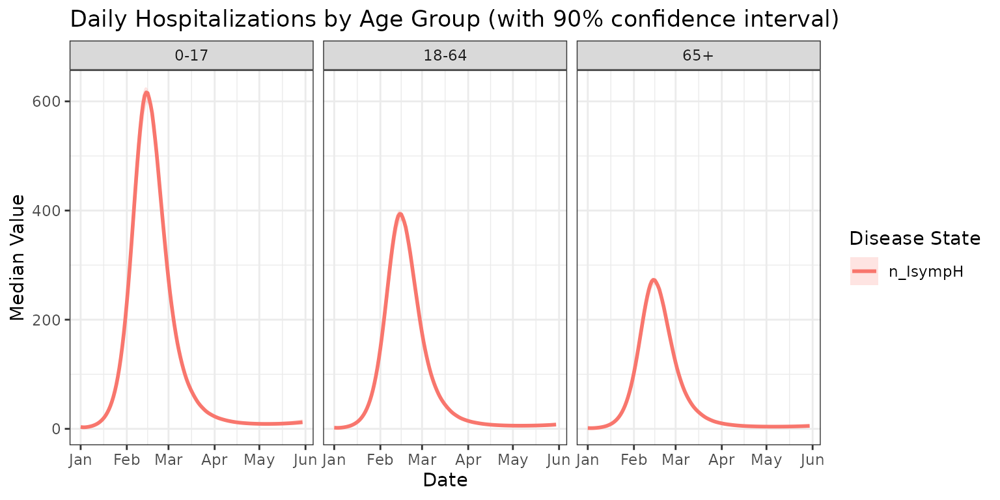
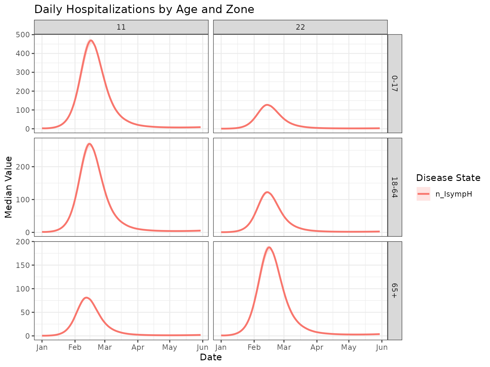
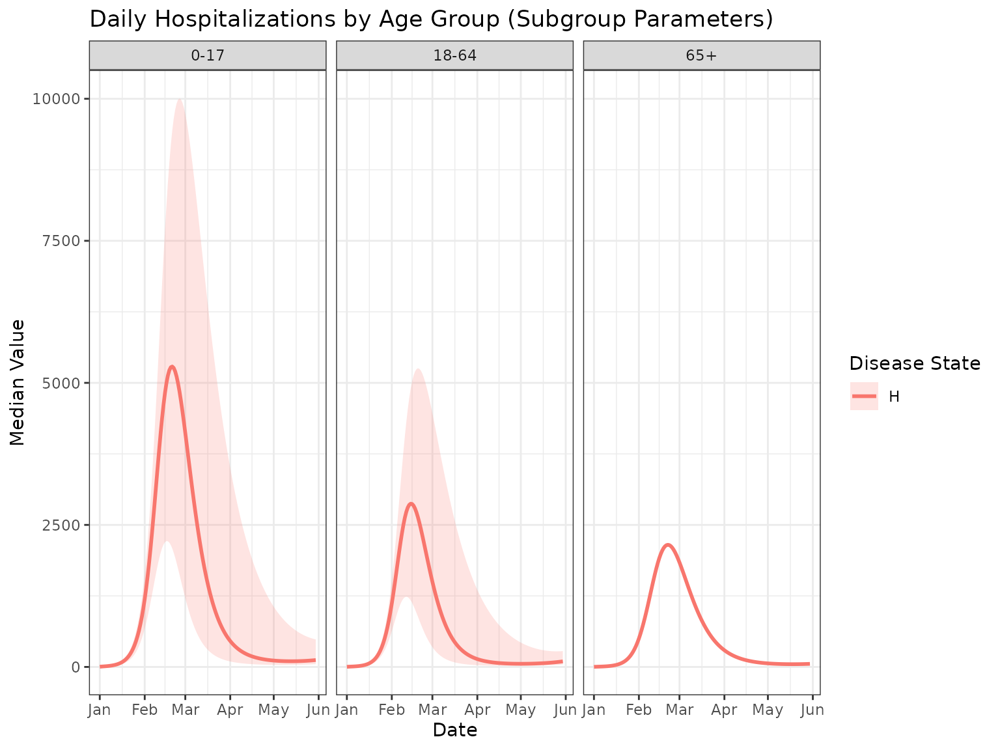

# Running a Simulation with metaRVM

### Introduction

This vignette demonstrates how to run a `metaRVM` simulation using the
example configuration and data files included with the package. This is
a good way to get started and understand the basic workflow.

### Locating the Example Files

The `metaRVM` package includes a set of example files in its `extdata`
directory. To run the example, we first need to locate these files. The
[`system.file()`](https://rdrr.io/r/base/system.file.html) function in R
is the recommended way to do this, as it will find the files wherever
the package is installed.

``` r
# Locate the example YAML configuration file
yaml_file <- system.file("extdata", "example_config.yaml", package = "MetaRVM")
print(yaml_file)
#> [1] "/home/runner/work/_temp/Library/MetaRVM/extdata/example_config.yaml"
```

The `yaml_file` variable now holds the full path to the example
configuration file. This file is set up to use the other example data
files (also in the `extdata` directory) with relative paths. Below is
the content of the yaml file.

``` yaml
run_id: ExampleRun
population_data:
  mapping: demographic_mapping_n24.csv
  initialization: population_init_n24.csv
  vaccination: vaccination_n24.csv
mixing_matrix:
  weekday_day: m_weekday_day.csv
  weekday_night: m_weekday_night.csv
  weekend_day: m_weekend_day.csv
  weekend_night: m_weekend_night.csv
disease_params:
  ts: 0.5
  tv: 0.25
  ve: 0.4
  dv: 180
  dp: 1
  de: 3
  da: 5
  ds: 6
  dh: 8
  dr: 180
  pea: 0.3
  psr: 0.95
  phr: 0.97
simulation_config:
  start_date: 01/01/2023 # m/d/Y
  length: 150
  nsim: 1
```

### Running the Simulation

Once we have the path to the configuration file, the simulation can be
run using the
[`metaRVM()`](https://RESUME-Epi.github.io/MetaRVM/reference/metaRVM.md)
function.

``` r
# Load the metaRVM library
library(MetaRVM)
options(odin.verbose = FALSE)

# Run the simulation
sim_out <- metaRVM(yaml_file)
#> Loading required namespace: pkgbuild
```

The
[`metaRVM()`](https://RESUME-Epi.github.io/MetaRVM/reference/metaRVM.md)
function will parse the YAML file, read the associated data files, run
the simulation, and return a `MetaRVMResults` object.

### Deep-dive into `MetaRVM` Classes

#### Working with Configuration Files

The simulation can be run by directly providing a YAML configuration
file path, or by creating a `MetaRVMConfig` object.

``` r
# Load configuration from YAML file
config_obj <- MetaRVMConfig$new(yaml_file)

# Examine the configuration
config_obj
#> MetaRVM Configuration Object
#> ============================
#> Config file: /home/runner/work/_temp/Library/MetaRVM/extdata/example_config.yaml 
#> Parameters: 40 
#> Parameter names (first 10): N_pop, pop_map, S_ini, E_ini, I_asymp_ini, I_presymp_ini, I_symp_ini, H_ini, D_ini, P_ini ...
#> Population groups: 24 
#> Start date: 2023-09-30 
#> Population mapping: [ 24 rows x 4 columns]
```

#### Exploring Configuration Parameters

The `MetaRVMConfig` class provides several methods to explore the
simulation arguments:

``` r
# List all available parameters
param_names <- config_obj$list_parameters()
head(param_names, 10)
#>  [1] "N_pop"         "pop_map"       "S_ini"         "E_ini"        
#>  [5] "I_asymp_ini"   "I_presymp_ini" "I_symp_ini"    "H_ini"        
#>  [9] "D_ini"         "P_ini"

# Get a summary of parameter types and sizes
param_summary <- config_obj$parameter_summary()
head(param_summary, 10)
#>                   parameter       type length size
#> N_pop                 N_pop    integer      1    1
#> pop_map             pop_map data.table      4    4
#> S_ini                 S_ini    integer     24   24
#> E_ini                 E_ini    numeric     24   24
#> I_asymp_ini     I_asymp_ini    numeric     24   24
#> I_presymp_ini I_presymp_ini    numeric     24   24
#> I_symp_ini       I_symp_ini    integer     24   24
#> H_ini                 H_ini    numeric     24   24
#> D_ini                 D_ini    numeric     24   24
#> P_ini                 P_ini    integer     24   24
```

#### Accessing Demographic Information

One of MetaRVM’s key features is demographic stratification, and it’s
ability to define parameters for specific demographic strata.

``` r
# Get demographic categories
age_categories <- config_obj$get_age_categories()
race_categories <- config_obj$get_race_categories()
zones <- config_obj$get_zones()

cat("Age categories:", paste(age_categories, collapse = ", "), "\n")
#> Age categories: 0-17, 18-64, 65+
cat("Race categories:", paste(race_categories, collapse = ", "), "\n")
#> Race categories: A, B, C, D
cat("Geographic zones:", paste(zones, collapse = ", "), "\n")
#> Geographic zones: 11, 22
```

#### Alternative Ways to Run the Simulation

``` r
# Method 1: Direct from file path
# sim_out <- metaRVM(config_file)

# Method 2: From MetaRVMConfig object
sim_out <- metaRVM(config_obj)

# Method 3: From parsed configuration list
config_list <- parse_config(yaml_file)
sim_out <- metaRVM(config_list)
```

### Exploring the Results

The
[`metaRVM()`](https://RESUME-Epi.github.io/MetaRVM/reference/metaRVM.md)
function returns a `MetaRVMResults` object with formatted,
analysis-ready data. The results are formatted with calendar dates and
demographic attributes, and stored in a data frame called results:

``` r
# Look at the structure of formatted results
head(sim_out$results)
#>          date    age   race   zone disease_state        value instance
#>        <Date> <char> <char> <char>        <char>        <num>    <int>
#> 1: 2023-10-01   0-17      A     11             D 2.252583e-04        1
#> 2: 2023-10-01   0-17      A     11             E 1.305178e+01        1
#> 3: 2023-10-01   0-17      A     11             H 2.304447e-01        1
#> 4: 2023-10-01   0-17      A     11         I_all 2.731688e+01        1
#> 5: 2023-10-01   0-17      A     11       I_asymp 3.227854e-01        1
#> 6: 2023-10-01   0-17      A     11         I_eff 2.476245e+01        1

# Check unique values for key variables
cat("Disease states:", paste(unique(sim_out$results$disease_state), collapse = ", "), "\n")
#> Disease states: D, E, H, I_all, I_asymp, I_eff, I_presymp, I_symp, P, R, S, V, cum_V, mob_pop, n_EI, n_EIpresymp, n_HD, n_HR, n_HRD, n_IasympR, n_IsympH, n_IsympR, n_IsympRH, n_SE, n_SV, n_VE, n_VS, n_preIsymp, p_HRD, p_SE, p_VE
cat("Date range:", paste(range(sim_out$results$date), collapse = " to "), "\n")
#> Date range: 2023-10-01 to 2024-02-27
```

#### Data Subsetting and Filtering

The `subset_data()` method provides flexible filtering across all
demographic and temporal dimensions. It returns an object of class
`MetaRVMResults`.

``` r
# Subset by single criteria
hospitalized_data <- sim_out$subset_data(disease_states = "H")
hospitalized_data$results
#>             date    age   race   zone disease_state      value instance
#>           <Date> <char> <char> <char>        <char>      <num>    <int>
#>    1: 2023-10-01   0-17      A     11             H  0.2304447        1
#>    2: 2023-10-01   0-17      B     11             H  0.5203590        1
#>    3: 2023-10-01   0-17      C     11             H  0.6244308        1
#>    4: 2023-10-01   0-17      D     11             H  1.4867401        1
#>    5: 2023-10-01  18-64      A     11             H  0.3047817        1
#>   ---                                                                  
#> 3596: 2024-02-27  18-64      D     22             H  3.0363099        1
#> 3597: 2024-02-27    65+      A     22             H  1.1367252        1
#> 3598: 2024-02-27    65+      B     22             H  1.8119748        1
#> 3599: 2024-02-27    65+      C     22             H 10.5239938        1
#> 3600: 2024-02-27    65+      D     22             H 11.8169822        1

# Subset by multiple demographic categories
elderly_data <- sim_out$subset_data(
  age = c("65+"),
  disease_states = c("H", "D")
)
elderly_data$results
#>             date    age   race   zone disease_state        value instance
#>           <Date> <char> <char> <char>        <char>        <num>    <int>
#>    1: 2023-10-01    65+      A     11             D 2.179919e-05        1
#>    2: 2023-10-01    65+      A     11             H 2.230110e-02        1
#>    3: 2023-10-01    65+      B     11             D 8.719675e-05        1
#>    4: 2023-10-01    65+      B     11             H 8.920441e-02        1
#>    5: 2023-10-01    65+      C     11             D 8.719675e-05        1
#>   ---                                                                    
#> 2396: 2024-02-27    65+      B     22             H 1.811975e+00        1
#> 2397: 2024-02-27    65+      C     22             D 7.200555e+01        1
#> 2398: 2024-02-27    65+      C     22             H 1.052399e+01        1
#> 2399: 2024-02-27    65+      D     22             D 8.575588e+01        1
#> 2400: 2024-02-27    65+      D     22             H 1.181698e+01        1

# Specific date range
peak_period <- sim_out$subset_data(
  date_range = c(as.Date("2023-10-01"), as.Date("2023-12-31")),
  disease_states = "H"
)
#> 19631 
#> 19722
peak_period$results
#>             date    age   race   zone disease_state      value instance
#>           <Date> <char> <char> <char>        <char>      <num>    <int>
#>    1: 2023-10-01   0-17      A     11             H  0.2304447        1
#>    2: 2023-10-01   0-17      B     11             H  0.5203590        1
#>    3: 2023-10-01   0-17      C     11             H  0.6244308        1
#>    4: 2023-10-01   0-17      D     11             H  1.4867401        1
#>    5: 2023-10-01  18-64      A     11             H  0.3047817        1
#>   ---                                                                  
#> 2204: 2023-12-31  18-64      D     22             H 10.4461399        1
#> 2205: 2023-12-31    65+      A     22             H  1.4218017        1
#> 2206: 2023-12-31    65+      B     22             H  4.4579963        1
#> 2207: 2023-12-31    65+      C     22             H 55.2328788        1
#> 2208: 2023-12-31    65+      D     22             H 74.7225667        1
```

## Specifying Disease Parameter via Distributions

`metaRVM` allows for disease parameters to be specified as
distributions, which is useful for capturing uncertainty. When a
parameter is defined by a distribution, each simulation instance will
draw a new value from that distribution. For more details on the
available distributions and their parameters, refer to the
`yaml-configuration` vignette.

An example YAML file with parameter distributions is included in the
package, `example_config_dist.yaml`. Here is its content:

``` r
# Locate the example YAML configuration file with distributions
yaml_file_dist <- system.file("extdata", "example_config_dist.yaml", package = "MetaRVM")
```

``` yaml
run_id: ExampleRun_Dist
population_data:
  mapping: demographic_mapping_n24.csv
  initialization: population_init_n24.csv
  vaccination: vaccination_n24.csv
mixing_matrix:
  weekday_day: m_weekday_day.csv
  weekday_night: m_weekday_night.csv
  weekend_day: m_weekend_day.csv
  weekend_night: m_weekend_night.csv
disease_params:
  ts: 0.5
  tv: 0.25
  ve: 
    dist: uniform
    min: 0.3
    max: 0.5
  dv: 180
  dp: 1
  de: 3
  da: 
    dist: uniform
    min: 4
    max: 6
  ds: 
    dist: uniform
    min: 5
    max: 7
  dh: 
    dist: lognormal
    mu: 2
    sd: 0.5
  dr: 180
  pea: 0.3
  psr: 0.95
  phr: 0.97
simulation_config:
  start_date: 01/01/2023 # m/d/Y
  length: 150
  nsim: 20 # Increased nsim for meaningful summary statistics
```

To run a simulation with this configuration, we pass the file path to
`metaRVM`.

``` r
# Run the simulation with the new configuration
sim_out_dist <- metaRVM(yaml_file_dist)
```

### Generating Summary Statistics across Demographics

The `MetaRVMResults` class provides basic summarization functionality
across multiple instances of the simulation, when one or more disease
parameters are specified via distribution, and there are more than one
simulations per configurations. The `summarize` method generates output
of class `MetaRVMSummary` which has a `plot` method available to use.
Now that we have run a simulation with parameter distributions, we can
use the `summarize` method to see the variability in the results.

``` r
library(ggplot2)

# Summarize hospitalizations by age group
hospital_summary_dist <- sim_out_dist$summarize(
  group_by = c("age"),
  disease_states = "n_IsympH",
  stats = c("median", "quantile"),
  quantiles = c(0.05, 0.95)
)

# Plot the summary
hospital_summary_dist$plot() + ggtitle("Daily Hospitalizations by Age Group (with 90% confidence interval)") + theme_bw()
#> Warning: Using `size` aesthetic for lines was deprecated in ggplot2 3.4.0.
#> ℹ Please use `linewidth` instead.
#> ℹ The deprecated feature was likely used in the MetaRVM package.
#>   Please report the issue at <https://github.com/RESUME-Epi/MetaRVM/issues>.
#> This warning is displayed once every 8 hours.
#> Call `lifecycle::last_lifecycle_warnings()` to see where this warning was
#> generated.
```



``` r

# Summary of hospitalizations by age and race group
hospital_summary <- sim_out_dist$summarize(
  group_by = c("age", "race"),
  disease_states = "n_IsympH",
  stats = c("median", "quantile"),
  quantiles = c(0.05, 0.95)
)
hospital_summary
#> MetaRVM Summary Object
#> ======================
#> Data type: summary 
#> Observations: 1800 
#> Grouped by: age, race 
#> Disease states: n_IsympH 
#> Date range: 2023-01-01 to 2023-05-30 
#> Summary statistics: median_value, q05, q95

# visualize the summary
hospital_summary$plot() + ggtitle("Daily Hospitalizations by Age and Race") + theme_bw()
```



## Specifying Disease Parameters by Demographics

The disease parameters can also be specified for different demographic
subgroups. These subgroup-specific parameters will override the global
parameters. For more details, refer to the `yaml-configuration`
vignette. An example YAML file is provided,
`example_config_subgroup_dist.yaml`, that demonstrates this feature. It
also includes parameters defined by distributions.

``` r
# Locate the example YAML configuration file with subgroup parameters
yaml_file_subgroup <- system.file("extdata", "example_config_subgroup_dist.yaml", package = "MetaRVM")
```

``` yaml
run_id: ExampleRun_Subgroup_Dist
population_data:
  mapping: demographic_mapping_n24.csv
  initialization: population_init_n24.csv
  vaccination: vaccination_n24.csv
mixing_matrix:
  weekday_day: m_weekday_day.csv
  weekday_night: m_weekday_night.csv
  weekend_day: m_weekend_day.csv
  weekend_night: m_weekend_night.csv
disease_params:
  ts: 0.5
  tv: 0.25
  ve: 
    dist: uniform
    min: 0.3
    max: 0.5
  dv: 180
  dp: 1
  de: 3
  da: 5
  ds: 6
  dh: 
    dist: lognormal
    mu: 2
    sd: 0.5
  dr: 180
  pea: 0.3
  psr: 0.95
  phr: 0.97
sub_disease_params:
    age:
      0-17:
        pea: 0.08
      18-64:
        ts: 0.6
      65+:
        # This fixed value will override the global lognormal distribution for dh
        dh: 10 
        phr: 0.9227
simulation_config:
  start_date: 01/01/2023 # m/d/Y
  length: 150
  nsim: 20
```

Now, let’s run the simulation with this configuration.

``` r
# Run the simulation with the subgroup configuration
sim_out_subgroup <- metaRVM(yaml_file_subgroup)
```

We can now plot the results to see the impact of the subgroup-specific
parameters. For example, we can compare the number of hospitalizations
in the “65+” age group, which has a `dh` of 10, to other age groups that
use the global `dh` drawn from a lognormal distribution.

``` r
# Summarize hospitalizations by age group
hospital_summary_subgroup <- sim_out_subgroup$summarize(
  group_by = c("age"),
  disease_states = "H",
  stats = c("median", "quantile"),
  quantiles = c(0.025, 0.975)
)

# Plot the summary
hospital_summary_subgroup$plot() + ggtitle("Daily Hospitalizations by Age Group (Subgroup Parameters)") + theme_bw()
```


