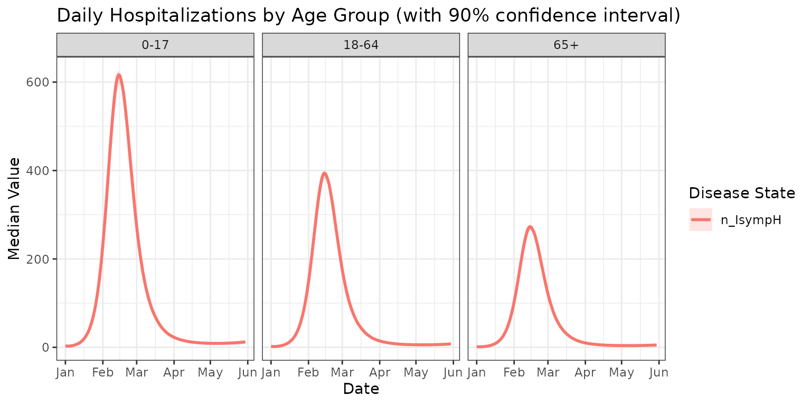
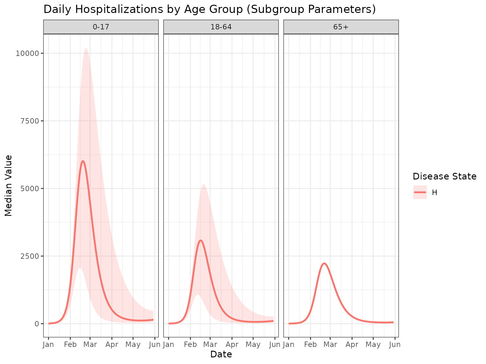

# Running a Simulation with metaRVM

### Introduction

This vignette demonstrates how to run a `metaRVM` simulation using the
example configuration and data files included with the package. This is
a good way to get started and understand the basic workflow.

### Locating the Example Files

The `metaRVM` package includes a set of example files in its `extdata`
directory. To run the example, these files must first be located. The
[`system.file()`](https://rdrr.io/r/base/system.file.html) function in R
is the recommended way to do this, as it finds the files wherever the
package is installed.

``` r
# Locate the example YAML configuration file
yaml_file <- system.file("extdata", "example_config.yaml", package = "MetaRVM")
print(yaml_file)
#> [1] "/home/runner/work/_temp/Library/MetaRVM/extdata/example_config.yaml"
```

The `yaml_file` variable now holds the full path to the example
configuration file. This file is set up to use the other example data
files (also in the `extdata` directory) with relative paths. Below is
the content of the yaml file.

``` yaml
run_id: ExampleRun
population_data:
  initialization: population_init_n24.csv
  vaccination: vaccination_n24.csv
mixing_matrix:
  weekday_day: m_weekday_day.csv
  weekday_night: m_weekday_night.csv
  weekend_day: m_weekend_day.csv
  weekend_night: m_weekend_night.csv
disease_params:
  ts: 0.5
  ve: 0.4
  dv: 180
  dp: 1
  de: 3
  da: 5
  ds: 6
  dh: 8
  dr: 180
  pea: 0.3
  psr: 0.95
  phr: 0.97
simulation_config:
  start_date: 01/01/2023 # m/d/Y
  length: 150
  nsim: 1
  nrep: 1
  simulation_mode: deterministic
  random_seed: 42
```

### Running the Simulation

Once the path to the configuration file is available, the simulation can
be run using the
[`metaRVM()`](https://RESUME-Epi.github.io/MetaRVM/reference/metaRVM.md)
function.

``` r
# Load the metaRVM library
library(MetaRVM)
options(odin.verbose = FALSE)

# Run the simulation
sim_out <- metaRVM(yaml_file)
#> Loading required namespace: pkgbuild
```

The
[`metaRVM()`](https://RESUME-Epi.github.io/MetaRVM/reference/metaRVM.md)
function will parse the YAML file, read the associated data files, run
the simulation, and return a `MetaRVMResults` object.

### Deep-dive into `MetaRVM` Classes

#### Working with Configuration Files

The simulation can be run by directly providing a YAML configuration
file path, or by creating a `MetaRVMConfig` object.

``` r
# Load configuration from YAML file
config_obj <- MetaRVMConfig$new(yaml_file)

# Examine the configuration
config_obj
#> MetaRVM Configuration Object
#> ============================
#> Config file: /home/runner/work/_temp/Library/MetaRVM/extdata/example_config.yaml 
#> Parameters: 42 
#> Parameter names (first 10): N_pop, pop_map, category_names, S_ini, E_ini, I_asymp_ini, I_presymp_ini, I_symp_ini, H_ini, D_ini ...
#> Population groups: 24 
#> Start date: 2023-09-30 
#> Population mapping: [ 24 rows x 4 columns]
```

#### Exploring Configuration Parameters

The `MetaRVMConfig` class provides several methods to explore the
simulation arguments:

``` r
# List all available parameters
param_names <- config_obj$list_parameters()
head(param_names, 10)
#>  [1] "N_pop"          "pop_map"        "category_names" "S_ini"         
#>  [5] "E_ini"          "I_asymp_ini"    "I_presymp_ini"  "I_symp_ini"    
#>  [9] "H_ini"          "D_ini"

# Get a summary of parameter types and sizes
param_summary <- config_obj$parameter_summary()
head(param_summary, 10)
#>                     parameter       type length size
#> N_pop                   N_pop    integer      1    1
#> pop_map               pop_map data.table      4    4
#> category_names category_names  character      3    3
#> S_ini                   S_ini    integer     24   24
#> E_ini                   E_ini    numeric     24   24
#> I_asymp_ini       I_asymp_ini    numeric     24   24
#> I_presymp_ini   I_presymp_ini    numeric     24   24
#> I_symp_ini         I_symp_ini    integer     24   24
#> H_ini                   H_ini    numeric     24   24
#> D_ini                   D_ini    numeric     24   24
```

#### Accessing Demographic Information

One of MetaRVM’s key features is demographic stratification, and it’s
ability to define parameters for specific demographic strata.

``` r
# Get user-defined demographic category names and values
category_names <- config_obj$get_category_names()
cat("Available categories:", paste(category_names, collapse = ", "), "\n")
#> Available categories: age, race, zone

# Example: inspect values for one category (if present)
if ("age" %in% category_names) {
  age_categories <- config_obj$get_category_values("age")
  cat("Age categories:", paste(age_categories, collapse = ", "), "\n")
}
#> Age categories: 0-17, 18-64, 65+
```

#### Alternative Ways to Run the Simulation

``` r
# Method 1: Direct from file path
# sim_out <- metaRVM(config_file)

# Method 2: From MetaRVMConfig object
sim_out <- metaRVM(config_obj)

# Method 3: From parsed configuration list
config_list <- parse_config(yaml_file)
sim_out <- metaRVM(config_list)
```

### Exploring the Results

The
[`metaRVM()`](https://RESUME-Epi.github.io/MetaRVM/reference/metaRVM.md)
function returns a `MetaRVMResults` object with formatted,
analysis-ready data. The results are formatted with calendar dates and
demographic attributes, and stored in a data frame called results:

``` r
# Look at the structure of formatted results
head(sim_out$results)
#>          date    age   race  zone disease_state        value instance
#>        <Date> <char> <char> <int>        <char>        <num>    <int>
#> 1: 2023-10-01   0-17      A    11             D 2.252583e-04        1
#> 2: 2023-10-01   0-17      A    11             E 1.365434e+01        1
#> 3: 2023-10-01   0-17      A    11             H 2.304447e-01        1
#> 4: 2023-10-01   0-17      A    11         I_all 2.742619e+01        1
#> 5: 2023-10-01   0-17      A    11       I_asymp 3.555784e-01        1
#> 6: 2023-10-01   0-17      A    11         I_eff 2.483657e+01        1

# Check unique values for key variables
cat("Disease states:", paste(unique(sim_out$results$disease_state), collapse = ", "), "\n")
#> Disease states: D, E, H, I_all, I_asymp, I_eff, I_presymp, I_symp, P, R, S, S_alloc, S_eff_prod, S_src_int, V, V_alloc, V_src_int, cum_V, mob_pop, n_EI, n_EIpresymp, n_HD, n_HR, n_HRD, n_IasympR, n_IsympH, n_IsympR, n_IsympRH, n_RS, n_SE, n_SE_eff, n_SV, n_VE, n_VS, n_preIsymp, p_HRD, p_RS, p_SE, p_VE
cat("Date range:", paste(range(sim_out$results$date), collapse = " to "), "\n")
#> Date range: 2023-10-01 to 2024-02-27
```

#### Data Subsetting and Filtering

The `subset_data()` method provides flexible filtering across all
demographic and temporal dimensions. It returns an object of class
`MetaRVMResults`.

``` r
# Subset by single criteria
hospitalized_data <- sim_out$subset_data(disease_states = "H")
hospitalized_data$results
#>             date    age   race  zone disease_state      value instance
#>           <Date> <char> <char> <int>        <char>      <num>    <int>
#>    1: 2023-10-01   0-17      A    11             H  0.2304447        1
#>    2: 2023-10-01   0-17      A    22             H  0.2081436        1
#>    3: 2023-10-01   0-17      B    11             H  0.5203590        1
#>    4: 2023-10-01   0-17      B    22             H  0.3939861        1
#>    5: 2023-10-01   0-17      C    11             H  0.6244308        1
#>   ---                                                                 
#> 3596: 2024-02-27    65+      B    22             H  1.2118718        1
#> 3597: 2024-02-27    65+      C    11             H  1.8624622        1
#> 3598: 2024-02-27    65+      C    22             H 10.2755842        1
#> 3599: 2024-02-27    65+      D    11             H  5.5349332        1
#> 3600: 2024-02-27    65+      D    22             H 12.4195984        1

# Subset by multiple demographic categories
elderly_data <- sim_out$subset_data(
  age = c("65+"),
  disease_states = c("H", "D")
)
elderly_data$results
#>             date    age   race  zone disease_state        value instance
#>           <Date> <char> <char> <int>        <char>        <num>    <int>
#>    1: 2023-10-01    65+      A    11             D 2.179919e-05        1
#>    2: 2023-10-01    65+      A    11             H 2.230110e-02        1
#>    3: 2023-10-01    65+      A    22             D 1.453279e-05        1
#>    4: 2023-10-01    65+      A    22             H 1.486740e-02        1
#>    5: 2023-10-01    65+      B    11             D 8.719675e-05        1
#>   ---                                                                   
#> 2396: 2024-02-27    65+      C    22             H 1.027558e+01        1
#> 2397: 2024-02-27    65+      D    11             D 3.831713e+01        1
#> 2398: 2024-02-27    65+      D    11             H 5.534933e+00        1
#> 2399: 2024-02-27    65+      D    22             D 8.635266e+01        1
#> 2400: 2024-02-27    65+      D    22             H 1.241960e+01        1

# Specific date range
peak_period <- sim_out$subset_data(
  date_range = c(as.Date("2023-10-01"), as.Date("2023-12-31")),
  disease_states = "H"
)
peak_period$results
#>             date    age   race  zone disease_state      value instance
#>           <Date> <char> <char> <int>        <char>      <num>    <int>
#>    1: 2023-10-01   0-17      A    11             H  0.2304447        1
#>    2: 2023-10-01   0-17      A    22             H  0.2081436        1
#>    3: 2023-10-01   0-17      B    11             H  0.5203590        1
#>    4: 2023-10-01   0-17      B    22             H  0.3939861        1
#>    5: 2023-10-01   0-17      C    11             H  0.6244308        1
#>   ---                                                                 
#> 2204: 2023-12-31    65+      B    22             H  7.0258803        1
#> 2205: 2023-12-31    65+      C    11             H  9.7905521        1
#> 2206: 2023-12-31    65+      C    22             H 52.9246952        1
#> 2207: 2023-12-31    65+      D    11             H 28.3456494        1
#> 2208: 2023-12-31    65+      D    22             H 63.2860726        1
```

## Specifying Disease Parameters via Distributions

`metaRVM` allows for disease parameters to be specified as
distributions, which is useful for capturing uncertainty. When a
parameter is defined by a distribution, each simulation instance will
draw a new value from that distribution. For more details on the
available distributions and their parameters, refer to the
`yaml-configuration` vignette.

An example YAML file with parameter distributions is included in the
package, `example_config_dist.yaml`. Here is its content:

``` r
# Locate the example YAML configuration file with distributions
yaml_file_dist <- system.file("extdata", "example_config_dist.yaml", package = "MetaRVM")
```

``` yaml
run_id: ExampleRun_Dist
population_data:
  initialization: population_init_n24.csv
  vaccination: vaccination_n24.csv
mixing_matrix:
  weekday_day: m_weekday_day.csv
  weekday_night: m_weekday_night.csv
  weekend_day: m_weekend_day.csv
  weekend_night: m_weekend_night.csv
disease_params:
  ts: 0.5
  ve: 
    dist: uniform
    min: 0.3
    max: 0.5
  dv: 180
  dp: 1
  de: 3
  da: 
    dist: uniform
    min: 4
    max: 6
  ds: 
    dist: uniform
    min: 5
    max: 7
  dh: 
    dist: lognormal
    mu: 2
    sd: 0.5
  dr: 180
  pea: 0.3
  psr: 0.95
  phr: 0.97
simulation_config:
  start_date: 01/01/2023 # m/d/Y
  length: 150
  nsim: 20 # Increased nsim for meaningful summary statistics
  nrep: 1
  simulation_mode: deterministic
  random_seed: 42
```

To run a simulation with this configuration, the file path is passed to
`metaRVM`.

``` r
# Run the simulation with the new configuration
sim_out_dist <- metaRVM(yaml_file_dist)
```

### Generating Summary Statistics across Demographics

The `MetaRVMResults` class provides basic summarization functionality
across multiple instances of the simulation, when one or more disease
parameters are specified via distribution, and there are more than one
simulations per configurations. The `summarize` method generates output
of class `MetaRVMSummary` which has a `plot` method available. After a
simulation is run with parameter distributions, the `summarize` method
can be used to inspect variability in the results.

``` r
library(ggplot2)

# Summarize hospitalizations by age group
hospital_summary_dist <- sim_out_dist$summarize(
  group_by = c("age"),
  disease_states = "n_IsympH",
  stats = c("median", "quantile"),
  quantiles = c(0.05, 0.95)
)

# Plot the summary
hospital_summary_dist$plot() + ggtitle("Daily Hospitalizations by Age Group (with 90% confidence interval)") + theme_bw()
```



## Running a Stochastic Simulation with Static Parameters

A stochastic simulation can also be run by setting
`simulation_mode: stochastic`.

An example YAML file with parameter distributions is included in the
package, `example_config_stochastic.yaml`. Here is its content:

``` r
# Locate the example YAML configuration file with distributions
yaml_file_stoch <- system.file("extdata", "example_config_stochastic.yaml", package = "MetaRVM")
```

``` yaml
run_id: ExampleRun_Stochastic_Static
population_data:
  initialization: population_init_n24.csv
  vaccination: vaccination_n24.csv
mixing_matrix:
  weekday_day: m_weekday_day.csv
  weekday_night: m_weekday_night.csv
  weekend_day: m_weekend_day.csv
  weekend_night: m_weekend_night.csv
disease_params:
  ts: 0.5
  ve: 0.4
  dv: 180
  dp: 1
  de: 3
  da: 5
  ds: 6
  dh: 8
  dr: 180
  pea: 0.3
  psr: 0.95
  phr: 0.97
simulation_config:
  start_date: 01/01/2023 # m/d/Y
  length: 150
  nsim: 1
  nrep: 5
  simulation_mode: stochastic
  random_seed: 42
```

``` r
sim_out_stoch <- metaRVM(yaml_file_stoch)
```

## Specifying Disease Parameters by Demographics

The disease parameters can also be specified for different demographic
subgroups. These subgroup-specific parameters will override the global
parameters. For more details, refer to the `yaml-configuration`
vignette. An example YAML file is provided,
`example_config_subgroup_dist.yaml`, that demonstrates this feature. It
also includes parameters defined by distributions.

``` r
# Locate the example YAML configuration file with subgroup parameters
yaml_file_subgroup <- system.file("extdata", "example_config_subgroup_dist.yaml", package = "MetaRVM")
```

``` yaml
run_id: ExampleRun_Subgroup_Dist
population_data:
  initialization: population_init_n24.csv
  vaccination: vaccination_n24.csv
mixing_matrix:
  weekday_day: m_weekday_day.csv
  weekday_night: m_weekday_night.csv
  weekend_day: m_weekend_day.csv
  weekend_night: m_weekend_night.csv
disease_params:
  ts: 0.5
  ve: 
    dist: uniform
    min: 0.3
    max: 0.5
  dv: 180
  dp: 1
  de: 3
  da: 5
  ds: 6
  dh: 
    dist: lognormal
    mu: 2
    sd: 0.5
  dr: 180
  pea: 0.3
  psr: 0.95
  phr: 0.97
sub_disease_params:
    age:
      0-17:
        pea: 0.08
      18-64:
        ts: 0.6
      65+:
        # This fixed value will override the global lognormal distribution for dh
        dh: 10 
        phr: 0.9227
simulation_config:
  start_date: 01/01/2023 # m/d/Y
  length: 150
  nsim: 20
  nrep: 1
  simulation_mode: deterministic
  random_seed: 42
```

Now, let’s run the simulation with this configuration.

``` r
# Run the simulation with the subgroup configuration
sim_out_subgroup <- metaRVM(yaml_file_subgroup)
```

The results can now be plotted to evaluate the impact of
subgroup-specific parameters. For example, the number of
hospitalizations in the “65+” age group, which has a `dh` of 10, can be
compared to other age groups that use the global `dh` drawn from a
lognormal distribution.

``` r
# Summarize hospitalizations by age group
hospital_summary_subgroup <- sim_out_subgroup$summarize(
  group_by = c("age"),
  disease_states = "H",
  stats = c("median", "quantile"),
  quantiles = c(0.025, 0.975)
)

# Plot the summary
hospital_summary_subgroup$plot() + ggtitle("Daily Hospitalizations by Age Group (Subgroup Parameters)") + theme_bw()
```


